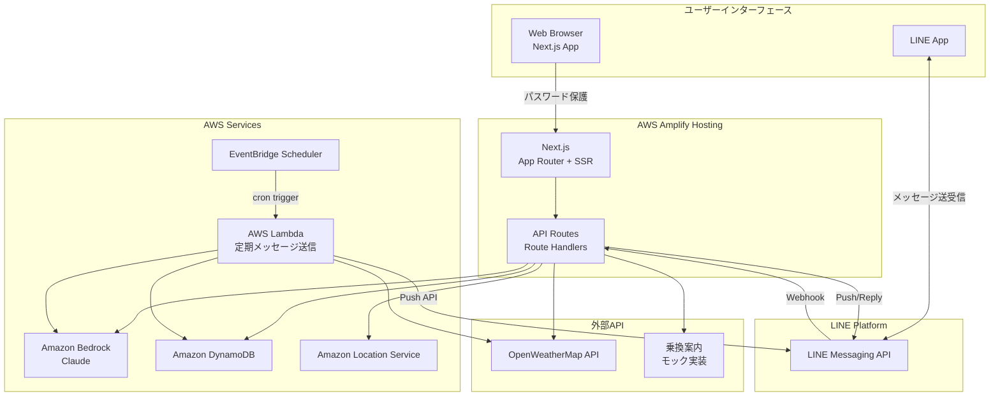
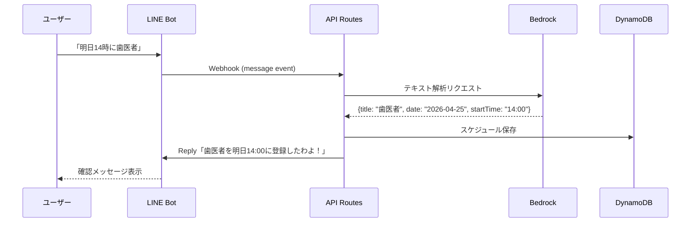
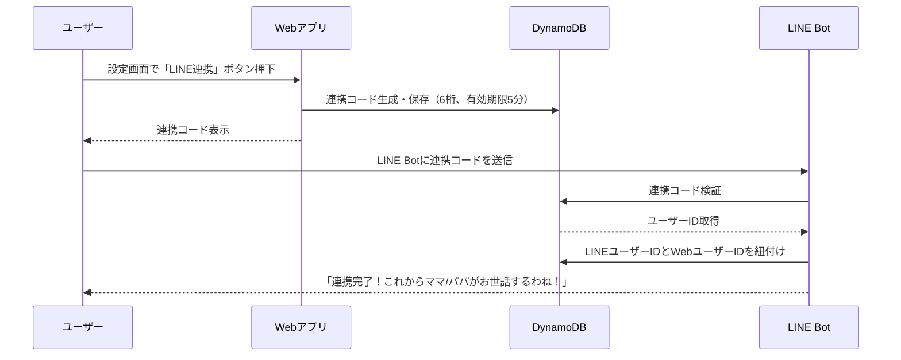

# 技術設計ドキュメント: ファザコン・マザコン養成AI

## 概要（Overview）

「ファザコン・マザコン養成AI」は、AIが過保護な親として振る舞い、ユーザーの日常生活に徹底的におせっかいを焼くWebサービスとLINE Botの統合システムである。

### システム構成の全体像

本システムは **Web（Amplify）** と **LINE** の2つのインターフェースで構成される：

- **Web（Next.js on Amplify Hosting）**: ファザコン度診断、設定画面、日記閲覧、学習計画管理、スケジュール管理
- **LINE Bot**: おせっかいメッセージ送信（朝のルーティン、天気リマインド、傘リマインド、スケジュールリマインド、心配メッセージ、褒めメッセージ等）、スケジュール登録（自然言語テキストから予定を自動抽出・登録）

認証はAmplify Hostingのアクセスコントロール機能（パスワード保護）を使用し、Cognitoは使用しない。LINE側はLINEユーザーIDで識別する。

### 技術スタック

| レイヤー | 技術 | 用途 |
|---------|------|------|
| フロントエンド | Next.js (App Router) + TypeScript | SSR/SSG対応のWebアプリ |
| UIフレームワーク | Tailwind CSS + Framer Motion | スタイリング・アニメーション |
| AI基盤 | Amazon Bedrock (Claude) | 親キャラクターの会話・日記生成 |
| ルート検索 | Amazon Location Service | 日本語対応のルート案内 |
| 天気予報 | OpenWeatherMap API (`lang=ja`) | 天気情報取得 |
| 乗換案内 | モック実装 | Google Maps transit非対応のため |
| データベース | Amazon DynamoDB | サーバーレスNoSQL |
| 認証 | Amplifyベーシック認証（パスワード保護） | サイト全体のアクセス制限 |
| ホスティング | AWS Amplify Hosting | Next.jsデプロイ |
| 通知 | LINE Messaging API | おせっかいメッセージ送信 |
| スケジューラ | Amazon EventBridge Scheduler | 定期メッセージ送信トリガー |
| API | Next.js API Routes (Route Handlers) | バックエンドAPI |

### リサーチ結果サマリー

**Amplifyベーシック認証**: Amplify Hostingのアクセスコントロール機能で、ブランチ単位またはグローバルにユーザー名・パスワードを設定可能。SSRアプリの場合、設定変更後に再デプロイが必要。辞書攻撃対策のスロットリング機能あり。（[参考](https://docs.aws.amazon.com/amplify/latest/userguide/access-control.html)）

**LINE Messaging API**: Webhookでユーザーイベントを受信し、Reply API（応答）とPush API（能動的送信）でメッセージ送信。Node.js SDK（`@line/bot-sdk`）が公式提供。Channel Access TokenとChannel Secretで認証。（[参考](https://developers.line.biz/en/reference/messaging-api)）

**Amazon Bedrock**: JavaScript SDK v3でClaude モデルを呼び出し可能。InvokeModel APIとConverse APIの2つの呼び出し方法があり、Converse APIがモデル間の互換性が高い。（[参考](https://docs.aws.amazon.com/code-library/latest/ug/javascript_3_bedrock-runtime_code_examples.html)）

**EventBridge Scheduler**: cronまたはrate式で定期的にLambda関数を呼び出し可能。ワンタイムスケジュールにも対応。リトライポリシーとDLQ設定が可能。（[参考](https://docs.aws.amazon.com/lambda/latest/dg/with-eventbridge-scheduler.html)）

---

## アーキテクチャ（Architecture）

### システムアーキテクチャ図



### アーキテクチャの設計判断

1. **Next.js API Routes をバックエンドとして活用**: 別途API Gatewayを立てず、Next.jsのRoute Handlersでバックエンドロジックを実装。Amplify Hostingが自動的にLambda@Edgeまたはサーバーレス関数として実行するため、インフラ管理が不要。

2. **LINE Webhook受信もAPI Routesで処理**: `/api/line/webhook` エンドポイントでLINE Platformからのイベントを受信。署名検証を行い、セキュリティを確保。

3. **定期メッセージはEventBridge Scheduler + Lambda**: 朝のルーティン、スケジュールリマインド等の定期的なおせっかいメッセージは、EventBridge SchedulerがLambda関数をトリガーし、LINE Push APIで送信。Next.js API Routesでは長時間実行やcronジョブが困難なため。

4. **Amplifyベーシック認証でシンプルなアクセス制限**: Cognitoを使わず、Amplify Hostingのパスワード保護機能でWebアプリ全体を保護。ハッカソン向けにシンプルさを優先。ユーザー管理はDynamoDBで独自に行う。

5. **LINEユーザーIDとWebユーザーの紐付け**: LINEの友だち追加時にWebアプリ上で連携コードを発行し、LINEで送信することで紐付け。

---

## コンポーネントとインターフェース（Components and Interfaces）

### コンポーネント一覧

```mermaid
graph LR
    subgraph "フロントエンド（Next.js Pages）"
        DIAG_PAGE[診断ページ]
        SETTINGS_PAGE[設定ページ]
        DIARY_PAGE[日記ページ]
        STUDY_PAGE[学習計画ページ]
        SCHEDULE_PAGE[スケジュールページ]
    end

    subgraph "API Routes（バックエンド）"
        DIAG_API[/api/diagnosis]
        SETTINGS_API[/api/settings]
        DIARY_API[/api/diary]
        STUDY_API[/api/study-plan]
        SCHEDULE_API[/api/schedule]
        LINE_WEBHOOK[/api/line/webhook]
        LINE_LINK[/api/line/link]
    end

    subgraph "ドメインサービス"
        SCORE_CALC[ScoreCalculator<br/>ファザコン度算出]
        MSG_GEN[MessageGenerator<br/>おせっかいメッセージ生成]
        DIARY_GEN[DiaryGenerator<br/>日記自動生成]
        STUDY_PLAN[StudyPlanner<br/>学習計画生成]
        WEATHER_SVC[WeatherService<br/>天気情報取得]
        ROUTE_SVC[RouteService<br/>ルート検索]
    end

    subgraph "インフラサービス"
        LINE_CLIENT[LineClient<br/>LINE API通信]
        BEDROCK_CLIENT[BedrockClient<br/>AI呼び出し]
        DB_CLIENT[DynamoDBClient<br/>データアクセス]
    end
```

### 主要コンポーネント詳細

#### 1. ScoreCalculator（ファザコン度算出）

```typescript
interface DiagnosisQuestion {
  id: string;
  text: string;
  options: { label: string; score: number }[];
}

interface DiagnosisResult {
  fazaconScore: number;       // 0〜100
  title: string;              // 称号
  parentComment: string;      // 親キャラクターのコメント（Bedrock生成）
  shareText: string;          // SNSシェア用テキスト
}

// ScoreCalculator
function calculateFazaconScore(answers: number[]): number;
function getTitleByScore(score: number): string;
function generateShareText(score: number, title: string): string;
```

#### 2. MessageGenerator（おせっかいメッセージ生成）

```typescript
type ParentType = 'father' | 'mother';
type MessageCategory = 
  | 'morning_alarm' | 'weather_advice' | 'umbrella_reminder'
  | 'departure_reminder' | 'schedule_reminder' | 'study_reminder'
  | 'praise' | 'worry' | 'scold' | 'night_warning'
  | 'meal_reminder' | 'weather_alert'
  | 'schedule_registered' | 'schedule_parse_error';

interface MessageContext {
  category: MessageCategory;
  parentType: ParentType;
  userName: string;
  additionalData?: Record<string, unknown>; // 天気情報、予定名等
}

interface GeneratedMessage {
  text: string;
  emotion: 'worry' | 'happy' | 'angry' | 'sad' | 'proud';
}

// MessageGenerator - Bedrockを使用してキャラクター口調のメッセージを生成
async function generateOsekkaiMessage(context: MessageContext): Promise<GeneratedMessage>;
```

#### 3. LineClient（LINE API通信）

```typescript
interface LineClient {
  // Webhook署名検証
  verifySignature(body: string, signature: string): boolean;
  
  // メッセージ送信
  pushMessage(userId: string, messages: LineMessage[]): Promise<void>;
  replyMessage(replyToken: string, messages: LineMessage[]): Promise<void>;
  
  // ユーザー情報取得
  getProfile(userId: string): Promise<LineProfile>;
}

type LineMessage = TextMessage | FlexMessage;

interface TextMessage {
  type: 'text';
  text: string;
}

interface FlexMessage {
  type: 'flex';
  altText: string;
  contents: FlexContainer;
}
```

#### 4. DiaryGenerator（日記自動生成）

```typescript
interface DailyLog {
  userId: string;
  date: string;           // YYYY-MM-DD
  events: ActivityEvent[];
}

interface ActivityEvent {
  timestamp: string;
  type: 'schedule_completed' | 'study_done' | 'alarm_response' | 'location_update';
  description: string;
}

interface Diary {
  userId: string;
  date: string;
  title: string;          // 「今日のうちの子」
  content: string;        // 親目線の日記本文（Bedrock生成）
  parentComments: string; // 親の感想
}

async function generateDiary(log: DailyLog, parentType: ParentType): Promise<Diary>;
```

#### 5. StudyPlanner（学習計画生成）

```typescript
interface ExamInfo {
  subject: string;
  examDate: string;       // YYYY-MM-DD
  scope: string;          // 試験範囲
}

interface StudyPlan {
  userId: string;
  examId: string;
  dailyPlans: DailyStudyPlan[];
}

interface DailyStudyPlan {
  date: string;
  subject: string;
  content: string;        // 学習内容
  targetMinutes: number;  // 目標時間（分）
  breakInterval: number;  // 休憩間隔（分）
  completed: boolean;
  skippedCount: number;
}

async function generateStudyPlan(exam: ExamInfo): Promise<StudyPlan>;
async function adjustPlan(plan: StudyPlan, skippedDate: string): Promise<StudyPlan>;
```

#### 6. LINE Webhookハンドラ

```typescript
// /api/line/webhook のRoute Handler
interface WebhookEvent {
  type: 'message' | 'follow' | 'unfollow' | 'postback';
  source: { userId: string };
  replyToken?: string;
  message?: { type: string; text: string };
  postback?: { data: string };
}

// Webhookイベント処理フロー
// 1. 署名検証
// 2. イベントタイプに応じた処理分岐
//    - follow: 友だち追加 → ウェルカムメッセージ送信
//    - message: テキスト受信 → 連携コード処理 or スケジュール登録 or 親AIとの会話
//    - postback: ボタン操作 → 対応アクション実行
```

#### 6.1 LINEスケジュール登録パーサー

```typescript
// LINE経由のスケジュール登録を処理するモジュール
interface ParsedSchedule {
  title: string;           // 予定名
  date: string;            // YYYY-MM-DD
  startTime: string;       // HH:mm
  endTime?: string;        // HH:mm
  confidence: number;      // 抽出の確信度 0〜1
}

interface ScheduleParseResult {
  success: boolean;
  schedule?: ParsedSchedule;
  errorReason?: string;    // 抽出失敗時の理由
}

// Bedrockを使用して自然言語テキストからスケジュール情報を抽出
async function parseScheduleFromText(text: string, currentDate: string): Promise<ScheduleParseResult>;
```

LINEスケジュール登録のシーケンス：



#### 7. ユーザー連携フロー



### API Routes一覧

| エンドポイント | メソッド | 説明 |
|---------------|---------|------|
| `/api/diagnosis/questions` | GET | 診断質問一覧取得 |
| `/api/diagnosis/result` | POST | 診断結果算出 |
| `/api/settings` | GET/PUT | ユーザー設定取得・更新 |
| `/api/settings/parent-type` | PUT | 親キャラクター変更 |
| `/api/line/webhook` | POST | LINE Webhookエンドポイント |
| `/api/line/link` | POST | LINE連携コード生成 |
| `/api/diary` | GET | 日記一覧取得 |
| `/api/diary/[date]` | GET | 特定日の日記取得 |
| `/api/diary/weekly` | GET | 週間サマリー取得 |
| `/api/study-plan` | GET/POST | 学習計画取得・作成 |
| `/api/study-plan/[id]/complete` | POST | 学習完了報告 |
| `/api/schedule` | GET/POST | スケジュール取得・登録 |
| `/api/schedule/[id]` | PUT/DELETE | スケジュール更新・削除 |

---

## データモデル（Data Models）

### DynamoDB テーブル設計

シングルテーブルデザインを採用し、1つのテーブルで全エンティティを管理する。

**テーブル名**: `FazaconMazaconTable`

| PK | SK | 説明 |
|----|-----|------|
| `USER#{userId}` | `PROFILE` | ユーザープロフィール |
| `USER#{userId}` | `SETTINGS` | ユーザー設定 |
| `USER#{userId}` | `LINE#{lineUserId}` | LINE連携情報 |
| `USER#{userId}` | `SCORE` | ファザコン度スコア |
| `USER#{userId}` | `DIARY#{date}` | 日記データ |
| `USER#{userId}` | `DIARY_WEEKLY#{weekStart}` | 週間サマリー |
| `USER#{userId}` | `STUDY_PLAN#{examId}` | 学習計画 |
| `USER#{userId}` | `SCHEDULE#{scheduleId}` | スケジュール |
| `USER#{userId}` | `ACTIVITY#{date}#{timestamp}` | 行動ログ |
| `USER#{userId}` | `REWARD_POINTS` | ご褒美ポイント |
| `LINK_CODE#{code}` | `META` | LINE連携コード（TTL付き） |
| `LINE#{lineUserId}` | `USER_MAP` | LINEユーザーID→WebユーザーIDマッピング |

**GSI（グローバルセカンダリインデックス）**:

| GSI名 | PK | SK | 用途 |
|--------|-----|-----|------|
| `GSI1` | `GSI1PK` | `GSI1SK` | LINE IDからユーザー検索 |
| `GSI2` | `GSI2PK` | `GSI2SK` | 日付ベースのスケジュール検索 |

### 主要エンティティ

#### UserProfile
```typescript
interface UserProfile {
  PK: string;              // USER#{userId}
  SK: 'PROFILE';
  userId: string;
  displayName: string;
  createdAt: string;       // ISO 8601
  updatedAt: string;
}
```

#### UserSettings
```typescript
interface UserSettings {
  PK: string;              // USER#{userId}
  SK: 'SETTINGS';
  parentType: 'father' | 'mother';
  wakeUpTime: string;      // HH:mm
  location: {              // 自宅の位置情報（天気取得用）
    lat: number;
    lon: number;
    cityName: string;
  };
  enabledFeatures: {
    morningRoutine: boolean;
    weatherAlert: boolean;
    scheduleReminder: boolean;
    studyReminder: boolean;
    nightWarning: boolean;
    mealReminder: boolean;
  };
}
```

#### LineLinkage
```typescript
interface LineLinkage {
  PK: string;              // USER#{userId}
  SK: string;              // LINE#{lineUserId}
  lineUserId: string;
  linkedAt: string;
  GSI1PK: string;          // LINE#{lineUserId}
  GSI1SK: string;          // USER_MAP
}
```

#### LinkCode（TTL付き）
```typescript
interface LinkCode {
  PK: string;              // LINK_CODE#{code}
  SK: 'META';
  userId: string;
  code: string;            // 6桁の連携コード
  createdAt: string;
  ttl: number;             // Unix timestamp（5分後に自動削除）
}
```

#### FazaconScore
```typescript
interface FazaconScore {
  PK: string;              // USER#{userId}
  SK: 'SCORE';
  currentScore: number;    // 0〜100
  title: string;           // 称号
  diagnosisAnswers: number[];
  lastDiagnosisAt: string;
  autoScore: number;       // 利用頻度ベースの自動スコア
  updatedAt: string;
}
```

#### Diary
```typescript
interface DiaryRecord {
  PK: string;              // USER#{userId}
  SK: string;              // DIARY#{YYYY-MM-DD}
  date: string;
  title: string;
  content: string;
  parentComments: string;
  activitySummary: string[];
  GSI2PK: string;          // DATE#{YYYY-MM-DD}
  GSI2SK: string;          // USER#{userId}
}
```

#### Schedule
```typescript
interface ScheduleRecord {
  PK: string;              // USER#{userId}
  SK: string;              // SCHEDULE#{scheduleId}
  scheduleId: string;
  title: string;
  date: string;            // YYYY-MM-DD
  startTime: string;       // HH:mm
  endTime?: string;        // HH:mm
  location?: string;
  reminderSent: {
    dayBefore: boolean;
    twoHours: boolean;
    oneHour: boolean;
    thirtyMin: boolean;
    emergency: boolean;
  };
  completed: boolean;
  GSI2PK: string;          // DATE#{YYYY-MM-DD}
  GSI2SK: string;          // USER#{userId}#SCHEDULE#{startTime}
}
```

#### StudyPlanRecord
```typescript
interface StudyPlanRecord {
  PK: string;              // USER#{userId}
  SK: string;              // STUDY_PLAN#{examId}
  examId: string;
  subject: string;
  examDate: string;
  scope: string;
  dailyPlans: DailyStudyPlan[];
  consecutiveSkips: number;
  createdAt: string;
  updatedAt: string;
}
```

#### RewardPoints
```typescript
interface RewardPoints {
  PK: string;              // USER#{userId}
  SK: 'REWARD_POINTS';
  totalPoints: number;
  history: {
    date: string;
    reason: string;
    points: number;
  }[];
}
```


---

## 正当性プロパティ（Correctness Properties）

*プロパティとは、システムの全ての有効な実行において成り立つべき特性や振る舞いのことである。人間が読める仕様と、機械で検証可能な正当性保証の橋渡しとなる形式的な記述である。*

### Property 1: ファザコン度スコアの範囲不変条件

*任意の*回答配列（診断回答）または利用頻度データに対して、算出されるFazacon_Scoreは常に0以上100以下の整数である。

**Validates: Requirements 1.2, 1.5**

### Property 2: スコアから称号・シェアテキスト生成の完全性

*任意の*有効なFazacon_Score（0〜100）に対して、getTitleByScoreは空でない称号文字列を返し、generateShareTextはスコア値と称号を含む空でないテキストを返す。

**Validates: Requirements 1.3, 1.4**

### Property 3: 感情から表情へのマッピング完全性

*任意の*有効な感情タイプ（worry, happy, angry, sad, proud）に対して、感情→表情マッピング関数は有効な表情タイプを返し、undefinedやnullを返さない。

**Validates: Requirements 2.2**

### Property 4: 深夜時間帯判定

*任意の*時刻（0:00〜23:59）に対して、isNightTime関数は23:00〜翌5:59の場合にのみtrueを返す。

**Validates: Requirements 2.6, 7.3**

### Property 5: 長時間未使用判定

*任意の*最終利用時刻と現在時刻のペアに対して、経過時間が設定閾値を超えた場合にのみ未使用フラグがtrueになり、閾値以下の場合はfalseになる。

**Validates: Requirements 2.7**

### Property 6: ルート逸脱判定

*任意の*現在位置座標とルート座標列に対して、ルート上の最近接点からの距離が閾値を超えた場合にのみ逸脱と判定される。

**Validates: Requirements 3.2**

### Property 7: 迷子状態判定

*任意の*現在位置、目的地座標、滞在時間に対して、目的地からの距離が500m以上かつ滞在時間が10分以上の場合にのみ迷子と判定される。

**Validates: Requirements 3.3**

### Property 8: アラームエスカレーション単調増加

*任意の*未応答回数nに対して、getAlarmLevel(n)の返すメッセージ強度レベルは、getAlarmLevel(n-1)以上である（単調非減少）。

**Validates: Requirements 4.2**

### Property 9: 気温から服装アドバイスの一貫性

*任意の*気温値に対して、getClothingAdvice関数は空でないアドバイス文字列を返す。また、気温t1 < t2の場合、t1のアドバイスはt2のアドバイスと同等かより暖かい服装を推奨する。

**Validates: Requirements 4.3**

### Property 10: 降水確率による傘リマインド判定

*任意の*降水確率（0〜100の整数）に対して、shouldRemindUmbrella関数は降水確率が30以上の場合にのみtrueを返す。

**Validates: Requirements 4.4**

### Property 11: 出発時刻算出と緊急判定

*任意の*予定開始時刻と移動時間に対して、算出された出発時刻は「予定開始時刻 - 移動時間 - バッファ時間」であり、現在時刻が出発時刻の10分前を過ぎている場合にのみ緊急フラグがtrueになる。

**Validates: Requirements 4.5, 4.6**

### Property 12: 学習計画生成の構造的完全性

*任意の*有効な試験情報（科目、試験日、範囲）に対して、生成された学習計画は以下を満たす：(a) 今日から試験前日までの全日に計画が存在する、(b) 各日の計画にcontent（空でない）、targetMinutes（正の値）、breakInterval（正の値）が含まれる。

**Validates: Requirements 5.1, 5.2**

### Property 13: 学習計画再調整の完全性

*任意の*学習計画と任意のサボり日に対して、再調整後の計画は試験前日までの残り日数で全学習内容をカバーし、サボった日の内容が残りの日に再配分されている。

**Validates: Requirements 5.5**

### Property 14: 連続サボり日数判定

*任意の*サボり履歴（日付のリスト）に対して、getConsecutiveSkips関数は最新の連続サボり日数を正しく返し、3日以上の場合にのみ感情的メッセージフラグがtrueになる。

**Validates: Requirements 5.6**

### Property 15: 日記一覧のソート順

*任意の*日記レコード群に対して、一覧取得結果は日付の降順（新しい順）でソートされている。すなわち、リスト内の任意の隣接する2つの日記について、前の日記の日付は後の日記の日付より新しいか等しい。

**Validates: Requirements 6.5**

### Property 16: 食事リマインド判定

*任意の*現在時刻と食事記録状態に対して、shouldRemindMeal関数は食事時間（12:00または19:00）を過ぎて対応する食事記録がない場合にのみtrueを返す。

**Validates: Requirements 7.2**

### Property 17: ご褒美ポイント累計の正確性と閾値判定

*任意の*ポイント付与イベント列に対して、(a) 各付与ポイントは正の値であり、(b) 累計ポイントは全付与ポイントの合計と一致し、(c) 累計が閾値以上の場合にのみご褒美フラグがtrueになる。

**Validates: Requirements 8.3, 8.4**

### Property 18: スケジュールリマインド時刻算出

*任意の*予定開始時刻に対して、算出されるリマインド時刻は3つ（2時間前、1時間前、30分前）であり、時系列の昇順に並んでいる。

**Validates: Requirements 9.2**

### Property 19: 緊急リマインド判定

*任意の*予定開始時刻、現在時刻、応答状態に対して、予定開始15分前を切って未応答の場合にのみ緊急リマインドフラグがtrueになる。

**Validates: Requirements 9.4**

### Property 20: LINEスケジュールパース結果の構造的正しさ

*任意の*パース成功結果（success=true）に対して、scheduleフィールドは空でないtitle、有効な日付形式（YYYY-MM-DD）のdate、有効な時刻形式（HH:mm）のstartTime、0〜1の範囲のconfidenceを含む。

**Validates: Requirements 9.6, 9.7**

---

## エラーハンドリング（Error Handling）

### LINE Messaging API

| エラー状況 | 対処 |
|-----------|------|
| Webhook署名検証失敗 | 401を返し、リクエストを拒否。ログに記録 |
| Push API送信失敗（429 Rate Limit） | 指数バックオフでリトライ（最大3回） |
| Push API送信失敗（400 Invalid Request） | エラーログ記録、ユーザーへの通知はスキップ |
| LINE連携コード不正・期限切れ | 「コードが無効です。Webアプリで新しいコードを発行してください」と返信 |
| LINEユーザー未連携 | 「まずWebアプリでLINE連携を行ってください」と返信 |

### Amazon Bedrock

| エラー状況 | 対処 |
|-----------|------|
| API呼び出しタイムアウト | フォールバックのテンプレートメッセージを使用 |
| スロットリング（429） | 指数バックオフでリトライ（最大3回） |
| モデル応答が不適切 | テンプレートメッセージにフォールバック |

### DynamoDB

| エラー状況 | 対処 |
|-----------|------|
| 読み取り/書き込み失敗 | リトライ（SDK組み込みリトライ） |
| 条件付き書き込み失敗 | 楽観的ロック：最新データを再取得して再試行 |
| TTL切れの連携コード | 「コードの有効期限が切れました」とユーザーに通知 |

### 外部API（OpenWeatherMap、Amazon Location Service）

| エラー状況 | 対処 |
|-----------|------|
| API呼び出し失敗 | キャッシュされた前回データを使用。キャッシュもない場合は「天気情報を取得できませんでした」と通知 |
| レスポンス不正 | デフォルト値を使用し、エラーログ記録 |

### EventBridge Scheduler / Lambda

| エラー状況 | 対処 |
|-----------|------|
| Lambda実行失敗 | EventBridgeのリトライポリシーで自動リトライ（最大2回） |
| DLQ送信 | リトライ失敗時はDead Letter Queueに送信し、後で手動確認 |

---

## テスト戦略（Testing Strategy）

### テストの全体方針

本プロジェクトでは、**ユニットテスト**と**プロパティベーステスト**の二重アプローチで品質を確保する。

### プロパティベーステスト（PBT）

- **ライブラリ**: [fast-check](https://github.com/dubzzz/fast-check)（TypeScript/JavaScript向けPBTライブラリ）
- **最小実行回数**: 各プロパティテスト100回以上
- **タグ形式**: `Feature: fazacon-mazacon-ai, Property {number}: {property_text}`
- **対象**: 上記Correctness Propertiesセクションの全20プロパティ

各プロパティは1つのプロパティベーステストとして実装する。

#### PBT対象の主要ドメイン

1. **スコア算出ロジック**: ScoreCalculator（Property 1, 2）
2. **時刻判定ロジック**: 深夜判定、食事リマインド、緊急判定（Property 4, 5, 16, 19）
3. **位置情報判定ロジック**: ルート逸脱、迷子判定（Property 6, 7）
4. **計画生成ロジック**: StudyPlanner（Property 12, 13, 14）
5. **ポイント計算ロジック**: RewardPoints（Property 17）
6. **ソート・フィルタロジック**: 日記一覧（Property 15）
7. **閾値判定ロジック**: 降水確率、エスカレーション、リマインド時刻（Property 8, 9, 10, 11, 18）
8. **スケジュールパースロジック**: LINEテキストからのスケジュール抽出結果検証（Property 20）

### ユニットテスト

- **フレームワーク**: Vitest
- **対象**: 
  - 具体的なシナリオのテスト（EXAMPLEに分類された受け入れ基準）
  - エッジケース（空配列、境界値、null/undefined）
  - エラーハンドリング（API失敗時のフォールバック動作）
  - LINE Webhook署名検証
  - Bedrockプロンプト構築ロジック

### インテグレーションテスト

- **対象**:
  - LINE Messaging API通信（モック使用）
  - DynamoDBデータアクセス（DynamoDB Local使用）
  - Bedrock API呼び出し（モック使用）
  - EventBridge Scheduler → Lambda → LINE Push APIフロー
  - 外部API（OpenWeatherMap、Amazon Location Service）呼び出し

### E2Eテスト（ハッカソン向けに最小限）

- **対象**:
  - ファザコン度診断フロー（質問回答→スコア表示→シェアテキスト生成）
  - LINE連携フロー（コード発行→LINE送信→紐付け完了）
  - 基本的なページ遷移

### テストディレクトリ構成

```
__tests__/
├── unit/
│   ├── score-calculator.test.ts
│   ├── message-generator.test.ts
│   ├── study-planner.test.ts
│   ├── weather-service.test.ts
│   └── line-webhook.test.ts
├── property/
│   ├── score-calculator.property.test.ts
│   ├── time-judgment.property.test.ts
│   ├── location-judgment.property.test.ts
│   ├── study-planner.property.test.ts
│   ├── reward-points.property.test.ts
│   ├── diary-sort.property.test.ts
│   └── threshold-judgment.property.test.ts
│   └── schedule-parser.property.test.ts
├── integration/
│   ├── line-client.integration.test.ts
│   ├── dynamodb.integration.test.ts
│   └── bedrock-client.integration.test.ts
└── e2e/
    ├── diagnosis-flow.e2e.test.ts
    └── line-link-flow.e2e.test.ts
```
